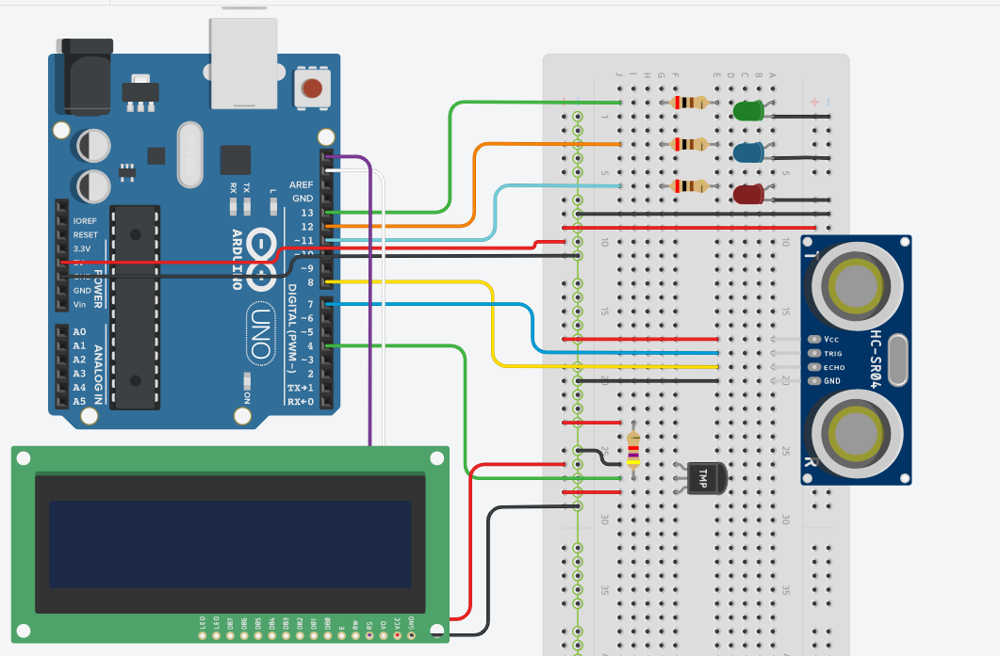

# A smart thermometer project with Arduino  

#### Instructions

- Download the source file
- Install the libraries in Arduino IDE
- Use Arduino IDE to run the program

<h3 align="center"> Hardware design <h3>

    

### Demonstration Videos

- [Video_1](https://drive.google.com/file/d/1lKqoEmVZKzf-UKLgz7fsJpBH1w_DY-Cr/view?usp=sharing)
- [Video_2](https://drive.google.com/file/d/1KP14Yv33usrxn_0RGIuUNsrDFcpkZt9P/view?usp=sharing)
