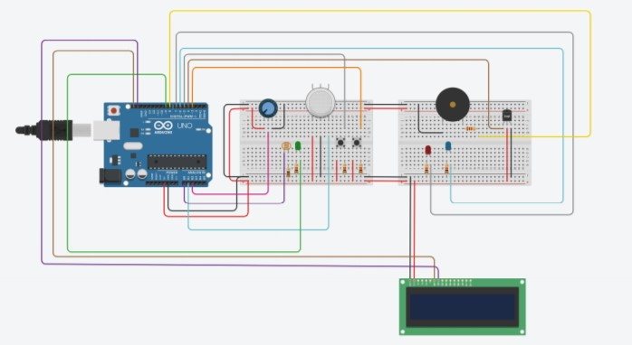
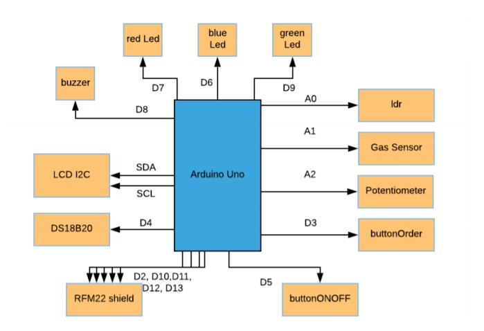
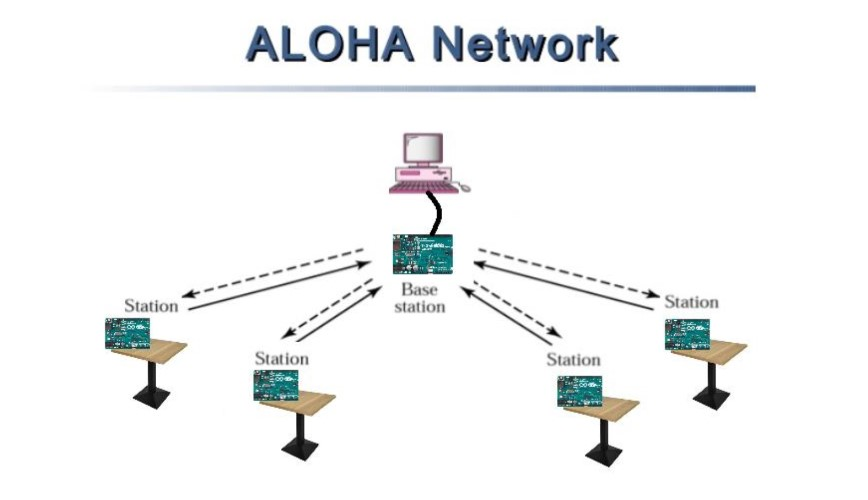

# A wireless network project

A smart application for restaurants using a wireless network.

 

Below you can see the circuit. 

Hardware design             |  Diagram Design
:-------------------------:|:-------------------------:
  |   |

 

The wireless network uses the ALOHA network. There are a lot of 
transmitters and a receiver as shown in the picture.

    

 

For the scope of this project two videos were created.
[Demo Video](https://www.youtube.com/watch?v=B45d_8eJRw4)
[Promotion Video](https://www.youtube.com/watch?v=ae23E55At5Y)